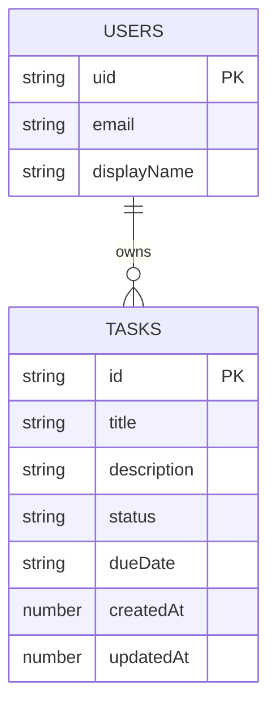

# PulseBoard

PulseBoard is a lightweight task management app built for the Week 2 full-stack assignment. It uses Firebase for authentication and Firestore for user-scoped CRUD data, while the frontend is a Vite + React + TypeScript application.

**Integrated with PDF Converter** - This project now includes a fully integrated PDF converter with 30+ professional PDF tools.

## Project Overview

The app solves a simple but common problem: keeping personal tasks organized after signing in. Users can register, log in, create tasks, update them, delete them, and keep their data isolated from other users through Firebase Authentication and Firestore security rules.

## Tech Stack

- **Frontend**: Vite + React + TypeScript
- **Backend-as-a-Service**: Firebase Authentication + Firestore
- **Deployment**: GitHub Actions builds the app and publishes the static site to GitHub Pages on every push to `main`

## Project Documentation

- [PLAN.md](PLAN.md) - Project concept, scope, and data model
- [BUILD_STEPS.md](BUILD_STEPS.md) - Incremental build steps and verify checkpoints

## Data Model

The data is stored in a user-scoped Firestore structure:



### Design Choices

- Each user owns a dedicated task subcollection at `users/{uid}/tasks`
- Firestore rules only allow the signed-in user to access their own documents
- Timestamps are stored with server timestamps so data stays consistent across devices

## Architecture Overview

The application follows a client-server architecture:

1. **Frontend (React)**: Handles UI, form submissions, and authentication state
2. **Firebase Auth**: Manages user registration, login, logout, and session persistence
3. **Firestore**: Stores user data in a user-scoped collection structure with security rules
4. **GitHub Actions**: CI/CD pipeline that builds and deploys the static site to GitHub Pages

## Installation

### Prerequisites

- Node.js 20 or newer
- An active Firebase project
- A GitHub repository with Pages enabled

### Setup

1. Clone the repository
2. Install dependencies: `npm install`
3. Copy `.env.example` to `.env` and fill in your Firebase values
4. Create a Firebase Authentication project and enable Email/Password sign-in
5. Create a Firestore database and deploy the security rules from `firestore.rules`

### Local Development

```bash
npm run dev
```

### Production Build

```bash
npm run build
```

## Usage Guide

1. Register with an email address and password
2. Sign in with the same credentials
3. Create a task with a title, status, due date, and notes
4. Edit or delete tasks from the dashboard
5. Sign out when you are finished

## Authentication

Authentication is handled by Firebase Auth. Password storage is managed by Firebase, so the app never stores plain-text passwords itself. Task data is only loaded after a user is signed in.

## CRUD Operations

- **Create**: Add a new task from the dashboard form
- **Read**: Load the signed-in user's task stream from Firestore with real-time updates
- **Update**: Edit a task by selecting it and saving changes
- **Delete**: Remove a task directly from the task list

## Deployment Notes

The repository includes a GitHub Actions workflow in `.github/workflows/deploy.yml` that builds the app and deploys it to GitHub Pages on pushes to `main`.

**Live URL**: https://ferdousbhuiya.github.io/pulseboard-week2/

## Environment Variables

The app expects the following variables in `.env`:

- `VITE_FIREBASE_API_KEY`
- `VITE_FIREBASE_AUTH_DOMAIN`
- `VITE_FIREBASE_PROJECT_ID`
- `VITE_FIREBASE_STORAGE_BUCKET`
- `VITE_FIREBASE_MESSAGING_SENDER_ID`
- `VITE_FIREBASE_APP_ID`

## Repository Checklist

- ✅ Version control is in place with Git
- ✅ CI/CD is configured with GitHub Actions
- ✅ Authentication is handled by Firebase
- ✅ Firestore rules protect user data
- ✅ The frontend supports registration, login, and CRUD features
- ✅ The README documents setup, architecture, and deployment
- ✅ PLAN.md and BUILD_STEPS.md are included
- ⚠️ GitHub issues/project board for progress tracking
- ⚠️ Demo video showing registration, login, and CRUD operations

## License

MIT
